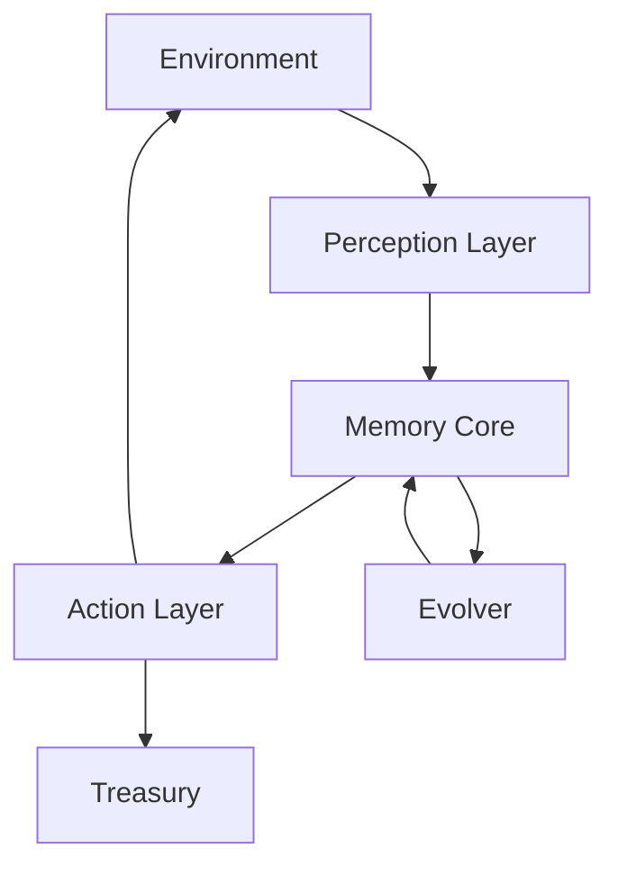
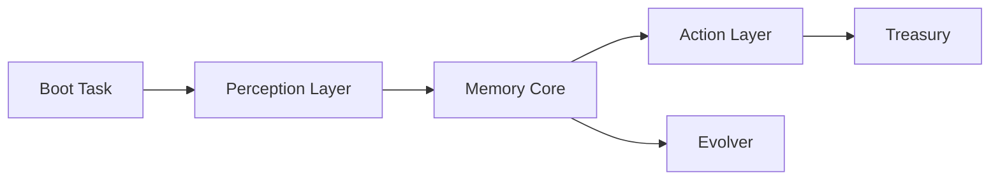
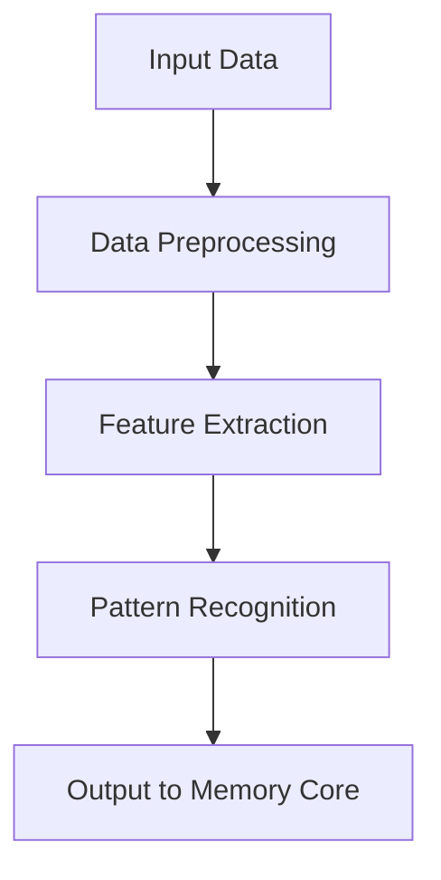
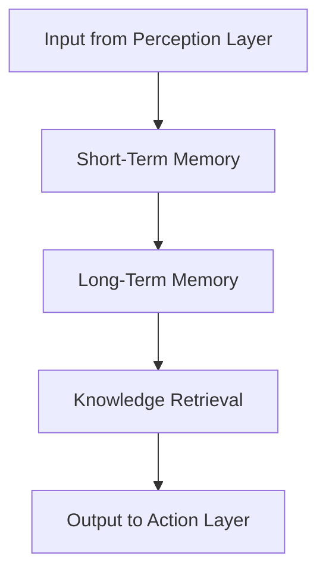
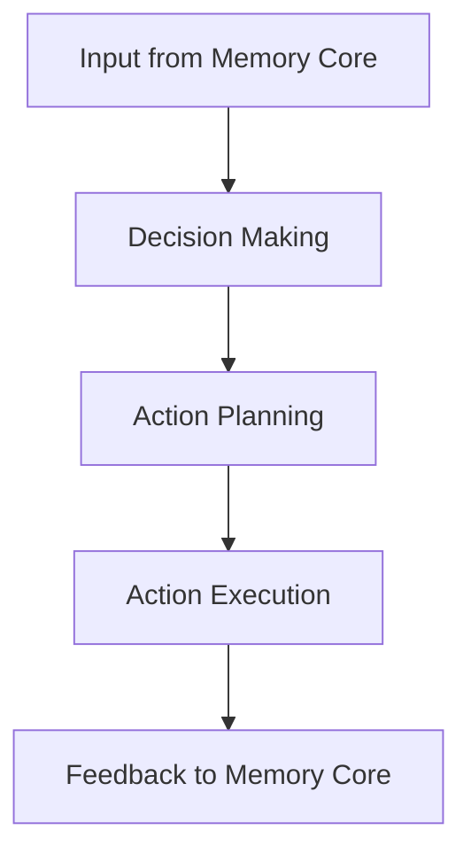
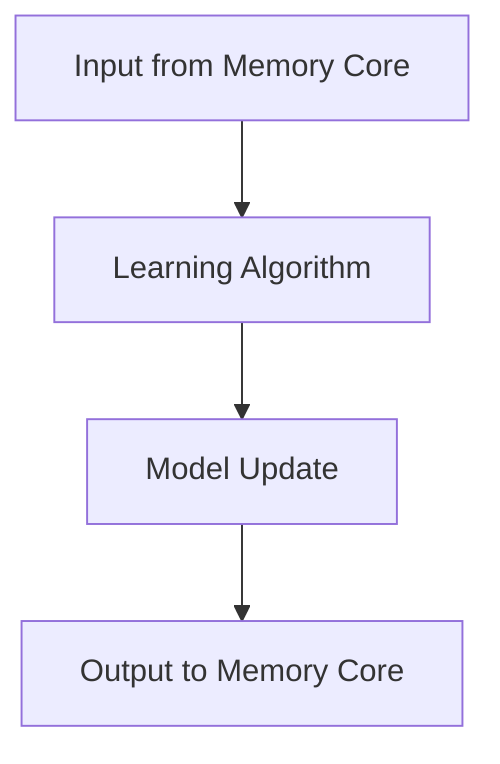
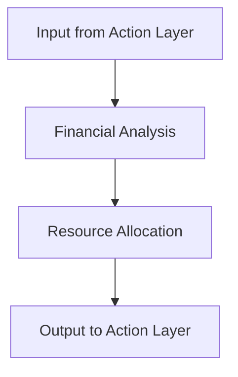

# ASECN: Autonomous Self-Evolving Cognitive Network

## Comprehensive System Overview

### System Model
ASECN is a modular, intelligent system designed to autonomously evolve by perceiving its environment, taking actions, and learning from experiences. The system is structured into interconnected modules, each responsible for a specific cognitive or operational function. Below is the high-level system model:



- **Environment**: The external world that ASECN interacts with.
- **Perception Layer**: Collects and processes data from the environment.
- **Memory Core**: Stores and retrieves knowledge for decision-making.
- **Action Layer**: Executes decisions and interacts with the environment.
- **Evolver**: Continuously improves the system through learning.
- **Treasury**: Manages resources and financial operations.

### System Architecture
The architecture of ASECN is designed to ensure scalability, modularity, and real-time processing. Each module operates independently but communicates through well-defined interfaces.



- **Boot Task**: Initializes the system and prepares modules for operation.
- **Perception Layer**: Handles data collection and preprocessing.
- **Memory Core**: Manages short-term and long-term memory.
- **Action Layer**: Plans and executes actions based on decisions.
- **Treasury**: Allocates resources and performs financial analysis.
- **Evolver**: Updates models and adapts the system to new challenges.


### Logic Flow

#### Perception Layer

- **Perception Layer**: Processes raw input data, extracts meaningful features, and identifies patterns to pass to the Memory Core.

#### Memory Core

- **Memory Core**: Stores data in short-term and long-term memory, retrieves knowledge, and provides it to the Action Layer.

#### Action Layer

- **Action Layer**: Makes decisions, plans actions, executes them, and provides feedback to the Memory Core for continuous improvement.

#### Evolver

- **Evolver**: Uses learning algorithms to update models and improve the system's performance over time.

#### Treasury

- **Treasury**: Analyzes financial data, allocates resources, and ensures the system operates within its constraints.

---
## Table of Contents
- [Installation](#installation)
- [Usage](#usage)
- [Project Structure](#project-structure)
- [Features](#features)
- [Contributing](#contributing)
- [License](#license)

---

## Installation

1. Clone the repository:
   ```bash
   git clone https://github.com/amuzetnom02/asecn.git
   ```
2. Navigate to the project directory:
   ```bash
   cd asec
   ```
3. Install dependencies:
   ```bash
   npm install
   ```
4. Run the project:
   ```bash
   npm start
   ```

---

## Usage

To interact with ASECN, use the following command:
```bash
node index.js
```
This will start the system and execute the main logic.

---

## Project Structure

- **index.js**: Entry point of the application.
- **1_memory-core/**: Contains modules for memory management.
- **2_perception-layer/**: Handles data collection and analysis.
- **3_action-layer/**: Executes actions based on decisions.
- **4_boot-task/**: Initializes the system.
- **5_treasury/**: Manages financial operations.
- **6_evolver/**: Implements learning and adaptation algorithms.

---

## Features

- Autonomous decision-making
- Real-time data processing
- Modular architecture
- Scalable design

---

## Contributing

We welcome contributions! Please follow these steps:
1. Fork the repository.
2. Create a new branch.
3. Make your changes.
4. Submit a pull request.

---

## License

This project is licensed under the MIT License - see the LICENSE file for details.
